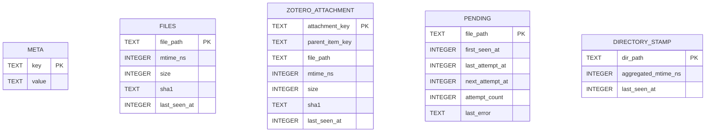

```mermaid
erDiagram
    META {
        TEXT key PK
        TEXT value
    }

    FILES {
        TEXT file_path PK
        INTEGER mtime_ns
        INTEGER size
        TEXT sha1
        INTEGER last_seen_at
    }

    ZOTERO_ATTACHMENT {
        TEXT attachment_key PK
        TEXT parent_item_key
        TEXT file_path
        INTEGER mtime_ns
        INTEGER size
        TEXT sha1
        INTEGER last_seen_at
    }

    PENDING {
        TEXT file_path PK
        INTEGER first_seen_at
        INTEGER last_attempt_at
        INTEGER next_attempt_at
        INTEGER attempt_count
        TEXT last_error
    }

    DIRECTORY_STAMP {
        TEXT dir_path PK
        INTEGER aggregated_mtime_ns
        INTEGER last_seen_at
    }
```
